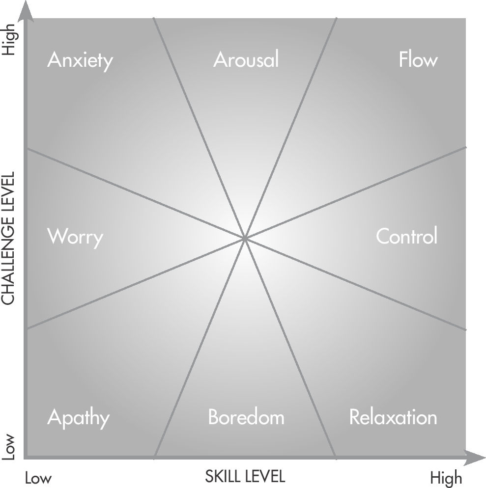

# 重新思考压力

1934 年，在麦吉尔大学的生物化学系，一位 28 岁的内分泌学家兼医学助理教授正试图发现一种新的激素。他的名字叫 Hans Selye，他完全有理由相信自己正在取得进步。当他给大鼠注射卵巢提取物时，希望引起只能用一种未被发现的性激素解释的变化，大鼠经历了一种独特的生理反应。他们的肾上腺皮质变大，免疫系统被激活。他注射的提取物越多，反应越大。 Selye 确信一种新的性激素正在引发这些生理变化。他兴高采烈。 “在 28 岁的时候，我似乎已经在寻找一种新的荷尔蒙了，”他在日记中写道。
对 Selye 来说不幸的是，当他在给老鼠注射与生殖系统无关的完全不同的液体后观察到同样的反应时，他的热情就消退了。即使是简单的盐水溶液也会引发相同的反应。他的兴高采烈变成了心碎：“我发现一种新激素的所有梦想都破灭了。投入这项长期研究的所有时间和所有材料都被浪费了。我变得如此沮丧，以至于有几天我根本无法做任何工作。我只是坐在实验室里，沉思。”虽然当时他并不知道，但 Selye 坚持的沉思最终会变成因祸得福。
当 Selye 继续思考他的实验时，他最终想到，也许他应该从一个完全不同的角度评估他所看到的：也许注射液中的液体没有引起反应。也许原因是注射本身的创伤。考虑到这个想法，Selye 迅速摆脱了陈规陋习，开始系统地对老鼠进行创伤。他给它们注射、电击、对它们进行手术，以及介于两者之间的一切。对于每一次新的创伤行为，他都观察到相同的反应：大鼠的肾上腺和免疫系统变得活跃。老鼠还没有准备好做爱。他们正在为战斗做好准备。
虽然 Selye 发现一种新荷尔蒙的梦想破灭了，但他的安慰奖却是一笔巨款。他在不知不觉中偶然发现了一个概念，该概念将成为现代社会最关心的问题之一：压力。通过做一些让老鼠感到震惊或引起疼痛和不适的事情——任何事情，真的——他可以触发一种先天的压力反应，我们现在知道这种反应几乎是每个生物体都有的。

## 剂量使人中毒

Selye 和那些以他的工作为基础的人开始向人类施加压力，并观察到他们在老鼠身上看到的相同现象。但他们也注意到了另一件事。随着时间的推移，人类和老鼠似乎都适应了每一种独特的压力源，从而增强了抵抗力。某些压力源甚至可以产生理想的效果，加强身体受到胁迫的特定部位。他们了解到压力不仅有害；它还可以作为增长和适应的刺激因素。
我们现在知道我们的适应性压力反应植根于称为炎症蛋白的分子和一种称为皮质醇的激素。炎症蛋白和皮质醇被压力激活并充当生物信使，告诉身体，“我们的力量不足以承受这种攻击！”结果，身体汇集了一大群生化积木并将它们引导到压力下的区域，从而使身体更强壮，更有弹性。这是身体令人难以置信的预编程方式，可以让自己更好地准备好面对未来的威胁。
正如我们前面提到的，加强肌肉，比如你的二头肌，是压力如何以积极方式发挥作用的一个很好的例子。将重物举到筋疲力尽的程度会导致肌肉组织出现微撕裂并引发压力反应。身体开始意识到它目前还不足以承受它所承受的压力。因此，一旦我们停止举重，身体就会转变为一种称为合成代谢的状态，在这种状态下，肌肉会逐渐增强，以便在未来承受更多的压力。同样的过程在几乎任何艰苦的体力努力后都会展开——从举重到跑步到划船再到具有挑战性的 CrossFit 锻炼。
然而，如果压力过大或持续时间过长，身体将无法适应。它实际上与变得更强大相反：它会恶化。 Selye 将此称为“精疲力竭阶段”。今天，许多人将精疲力竭阶段称为“长期压力”。身体反抗并进入一种称为分解代谢的过程，或持续崩溃的状态。升高的炎症和皮质醇并没有发出修复信号然后消退，而是在毒性水平上徘徊。肾上腺系统一直处于警戒状态，变得过度劳累和疲劳。这就是为什么慢性压力会导致无数健康问题并不奇怪。整个身体在断裂之前只能承受这么大的张力。
将所有这些放在一起，就会出现一个悖论。压力可以是积极的，触发身体所需的适应；或压力可能是负面的，造成严重的伤害和伤害。压力的影响几乎完全取决于剂量。当以正确的剂量使用时，压力不仅仅会刺激生理适应。它也刺激了心理上的人。

## 技能来自斗争

在回顾他作为精英表演者的发展历程时，国际象棋神童、武术世界冠军乔什·维茨金（Josh Waitzkin）在第 1 章末尾被介绍，他有一个有趣的见解：增长来自阻力；我们通过将自己推向我们能力的外围来学习。
虽然听起来威茨金指的是一种艰苦的武术锻炼，但事实并非如此。维茨金指的是他掌握国际象棋的过程。早在他甚至不知道太极拳是什么之前，韦茨金在下棋的过程中就已经把他的思想压得筋疲力尽了。虽然有无数关于将运动训练应用于非运动追求的书籍，但维茨金却恰恰相反。他采用了使他成为国际象棋世界冠军的训练理念，并以此成为武术世界冠军。即使当他只训练自己的头脑，仔细研究国际象棋图案及其背后的深层结构时，维茨金也不得不强调自己。为了引起增长，他不得不在阻力点上推。尽管 Waitzkin 的洞见发生在 20 多年前，但最新的学习科学开始揭示他的方法为何有效。
密歇根州奥克兰县一所公立高中教师的挫败感与全国各地的教师相似：超大班；数字设备干扰；当然，也没有足够的资源。但最重要的是，教师们对他们必须遵守的标准化国家课程“共同核心”感到沮丧。不管 Common Core 的用意有多好（它旨在确保每个年级的国家教育基线），它在奥克兰县的结果都不是很好。在最近的一次访问中，我们听到了以下信息：^1^

- “我知道[联邦政府] 需要一些教育标准，但结果是一种千篇一律的教学方法。它迫使我们教课程而不是教学生。” （十一年级科学老师）
- “它会在课堂外激发创造力，因为它迫使我们教某些测试。” （九年级英语老师）
- “太糟糕了。它迫使我们用勺子喂学生。这对最聪明的孩子来说尤其糟糕，因为我们没有自由去推动他们。所有的教学都在一个盒子里进行。” （十年级经济老师）

这些抱怨是有道理的。钻研具体的、可测试的事实来准备严格的标准化测试并不能促进学习。相反，科学表明，学习需要开放式探索，让学生超越个人极限。在涉及初中和高中数学课的一系列研究中，在获得老师帮助之前被迫在复杂问题上挣扎的学生优于立即获得帮助的学生。这些研究的作者用一个简单而优雅的陈述总结了他们的发现：技能来自斗争。
另一项名为“为什么在人工辅导期间只有一些事件会导致学习？”的研究发现答案很简单：因为大多数辅导员过早地给出答案和支持。在调查不同大学级别的物理辅导系统时，研究人员发现“无论采用何种辅导解释，当学生没有陷入僵局时，学习并不常见。”另一方面，最有效的辅导系统都有一个共同点：他们推迟教学，直到学生达到失败点。增长来自阻力点。技能来自奋斗。
同样的主题也适用于田径运动。无论是试图跑得更快的跑步者、正在尝试新动作的篮球运动员，还是试图掌握具有挑战性的骑行的大浪冲浪者，最大的收获往往伴随着巨大的挣扎和不适。
Nic Lamb 是世界上最好的大浪冲浪者之一。他骑着四层楼高的海浪。尽管他在水上的表现看起来很神奇，但它们的基础是他日复一日地培养的一丝不苟的训练方法和防弹的心态。当布拉德为《户外》杂志采访兰姆时，他特别有兴趣了解兰姆如何准备好面对最强烈的浪涌。兰姆的秘诀在于让自己不舒服。 “在训练期间，我寻找并尝试驾驭让我害怕的海浪，”兰姆说。 “只有当你走出舒适区时，你才会成长。不舒服是个人发展和成长的途径。这与自满相反。”
兰姆接受挑战，认为失败不是挫折，而是成长的机会。 “如果我从不挑战极限，如果我从不挣扎，我永远不会变得更好，”他说。如果有的话，羔羊面临最大挑战或失败的时候往往是最有价值的。他们发现了身体和心理上的弱点，并提供了他可以改进的领域的洞察力。他们充分利用他的大脑和身体来试图找出问题所在。他们提高了兰姆认为可能的标准。
Waitzkin、成功学习的学生和 Lamb 的实践被称为“生产性失败”。广泛的科学共识是，当我们经历这种失败时，就会发生最深刻的学习。接受挑战甚至失败是有益的，而不是简单地回答一个特定的问题。失败提供了从不同角度分析问题的机会，促使我们了解其深层结构并磨练解决问题本身的可转移技能。当然，即时援助可能会非常令人满意。但是当我们屈服于即时解决的冲动时，我们就会错过一种只有挑战才能产生的特殊深度学习。

## 系统 2 学习

诺贝尔奖获得者心理学家丹尼尔·卡尼曼博士指出，人类的思维分为两种类型：系统 1 和系统 2。系统 1 自动快速运行。它通常是由本能和直觉驱动的。另一方面，系统 2 更深思熟虑和分析，并处理费力的心理活动。系统 1 是我们的默认思维模式，因为它需要的能量更少。当我们处于自动驾驶状态时，系统 1 正在工作，我们当前的世界心智模型占主导地位。只有当我们通过真正努力工作并努力找出问题来激活系统 2 时，我们才有最好的机会批判性地检查新信息并将其整合到我们的知识网络中。真正的学习需要系统 2。
要理解为什么系统 2 学习如此具有挑战性，我们需要深入研究大脑。我们实际的知识网络由称为神经元的脑细胞组成，这些细胞由轴突连接，其功能就像大脑中的细电线。当我们学习新事物时，电活动会沿着这些轴突在神经元之间传播。起初，联系很弱（比喻和字面意义上的），我们在新技能上挣扎，无论是正确使用语法还是在篮球场上使用我们的非惯用手。如果我们屈服，选择不挣扎，系统 1 就会接管。我们默认大脑中已经很牢固的联系，并继续使用形容词而不是副词，或者用右手而不是左手运球。但是，如果我们忍受斗争并继续学习新技能，神经元之间的联系就会加强。这部分归功于一种叫做髓磷脂的物质。髓磷脂就像大脑的绝缘体，包裹着我们的轴突。当我们在某件事上工作得更多时，就会产生更多的髓鞘，这使得电活动能够在神经元之间更流畅地传播。换句话说，我们大脑中的联系加强了。随着时间的推移，我们以前的斗争变成了第二天性。
如果我们坚持学习一些东西足够长的时间，曾经艰巨的系统 2 挑战就变成了简单的系统 1 任务。只要问问任何学会如何用她的非惯用手运球的人。或者，问问自己：3 + 2 等于多少？ 6×4怎么样？
回想。回答这些问题并不总是那么容易。
这并不是说漫无目的的斗争促进学习。但这确实意味着最好的学习发生在我们真正必须为之努力的时候。就像在举重室里努力坚持最后一次重复是增长身体的好方法一样，努力到失败的地步，然后才接受帮助是增长头脑的好方法。如果你想在你所做的任何事情上不断进步，你必须将压力视为积极的，甚至是可取的。尽管过多或永无止境的压力可能是危险的，但适量的压力可以作为对成长的强大刺激。

> 表演实践
>
> - 压力刺激成长。
> - 正如国际象棋神童转为武术冠军的乔什·维茨金所说，“成长源于阻力。”
> - 培养新能力需要努力：技能来自奋斗。
> - 当你挣扎时，系统2被激活，真正的发展正在进行中； 髓磷脂正在积累，神经连接正在加强。
> - 富有成效地失败：只有在你让自己挣扎之后才寻求支持。

## 易于管理的挑战

当心理学家 Mihaly Csikszentmihalyi 博士研究表现最好的人如何进入该区域并不断提高时，他注意到他们都经常将自己推向自己的极限，也许只是超越了一点。 为了将神秘的“区域”转变为不那么模糊的东西，奇克森米哈伊开发了一种优雅的概念工具。

Csikszentmihalyi 的工具不仅可以帮助你找到进入该区域的方式，而且还可以作为一种很好的方式来调节成长所需的最佳压力。最好的压力，我们喜欢称之为“可控的挑战”，位于“流程”部分的右上角。
当你接受一些让你感觉有点失控但又不是很焦虑或过度兴奋的事情时，就会出现可控的挑战。2当手头的任务有点超出你的技能时，你就处于最佳状态。任何更少的挑战，你都会觉得“我已经把这个放在包里了。”这太容易了，也没有足够的压力来刺激增长。然而，任何更多的挑战，以及你的心跳在你的耳朵里怦怦直跳的令人不安的感觉都会让人难以集中注意力。你所追求的是甜蜜点：当手头的挑战在你当前技能的边缘，或者可能只是超出你当前技能的时候。
史蒂夫为他的世界级长跑运动员（如 Sara Hall）设计的训练是可控挑战的典型例子。在 2016 年世界半程马拉松锦标赛中接近赛场顶部之前，霍尔以每英里 5:30 的惊人速度完成了 15 英里的节奏跑，比以往任何时候都快。这些锻炼旨在扩展极限，将跑步者推到他们目前的能力之外。因此，史蒂夫的运动员出现训练有点紧张的情况并不少见。有些人甚至可能质疑他们是否能够完成锻炼。虽然扶手椅运动心理学家可能会说这种怀疑和不确定性是负面的，但史蒂夫有不同的看法。一点点的怀疑和不确定性其实是一件好事：它标志着一个增长机会已经出现。
你脑子里的小声音说，“我不可能做到这一点”，实际上表明你走在正确的轨道上。是你的思想试图将你拉回到代表你舒适区的熟悉路径。可管理的挑战是关于冒险走出一条已知的道路，然后走一条要求更高的道路。
这个概念几乎适用于任何事情，无论是锻炼、音乐表演还是办公室的项目。这就是 Csikszentmihalyi 图表的美妙之处。你可以在其上绘制任何活动。这样做时，重要的是要考虑到许多背景因素，这些因素会使一项活动在给定时间点或多或少具有挑战性。
外部因素可能包括：

- 天气
- 观众规模（或结果的赌注）
- 奖金
- 截止日期
- 分配给你一起工作的人（如果是小组/团队项目）

内部因素可能包括：

- 你当时生活中的其他压力源
- 你对活动的个人兴趣和动机
- 你的身心健康

考虑一下你平均每天从事的活动。它们在 Csikszentmihalyi 图表上的哪个位置？你是否以健康、可持续的方式追求增长？我们并不是建议你将所有时间都花在可以应对的挑战中。这样做可能不太实用。另外，你仍然需要在压力之间恢复，以使努力变得有益。然而，我们的建议是，对于你希望发展的能力——无论是金融建模、肖像画、长跑还是介于两者之间的任何东西——你应该定期寻找可控的挑战：让你摆脱困境的活动你的舒适区，并迫使你在成长的阻力点上推。
在本章中，我们探讨了压力的好处，研究了为什么技能来自于斗争，并了解了哪些类型的活动属于良好的、促进成长的压力——我们称之为可管理的挑战。接下来，我们将探讨你应该如何着手处理它们的机制，并解释为什么这么多关于“生产性”工作的传统智慧没有抓住重点。

> 表演实践
>
> 想一想你想要发展的技能/能力。
>
> 评估你当前执行此技能/能力的能力。
>
> 积极寻找刚刚超出你能力范围的挑战。
>
> 如果你觉得完全可以控制，那就让下一个挑战更难一些。
>
> 如果你感到焦虑或兴奋到无法集中注意力，请将事情调低一个档次。

1. 年级和科目已更改，以保护这些教师的身份。
2. Brad 最初是从密歇根大学的本科教授 Richard Price 那里听到“可管理的变化”这个词。